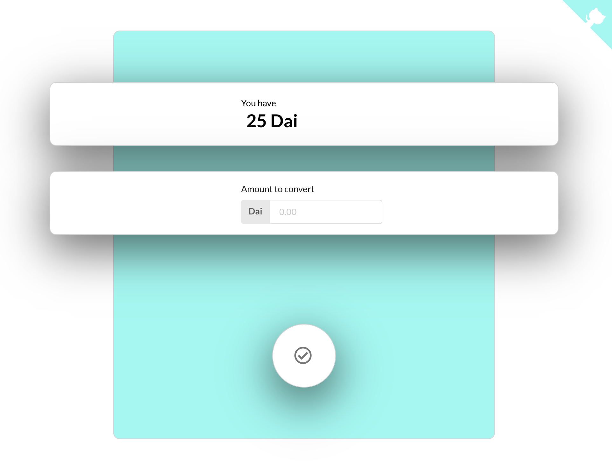

#Crypto Collateralized Vouchers

> Crypto Collateralized Vouchers allow distributions of crypto relief to be compliant with Government requirements such as [KYC](https://en.wikipedia.org/wiki/Know_your_customer) around the world  💸

* Currently deployed on the kovan test net

## Long Story Short

1. Send [Dai](https://makerdao.com/en/dai) to [the Stable Voucher web app](http://stable-voucher.now.sh/)
2. Admins will distribute Stable Vouchers to folks in need
3. Folks in need will spend Stable Vouchers at approved vendors
4. Approved vendors will "cash out" Stable Vouchers back to [Dai](https://makerdao.com/en/dai) in [the Stable Voucher web app](https://stable-voucher.now.sh/recipient)

## Technical Breakdown

Stable voucher is a token wrapping system for stable coins. It allows administrators to give "Stable Vouchers" to refugees which are pegged to the United States Dollar. Refugees can spend their Stable Vouchers at approved vendors like grocery stores.

Grocery stores and other approved vendors are able to "cash out" these vouchers back to Dai whenever they need their funds liquid. This helps with KYC compliance by allowing distribution of vouchers **instead** of distributing crypto itself.

## Stack

* React
* Solidity
* [Create React App](https://github.com/facebook/create-react-app)
